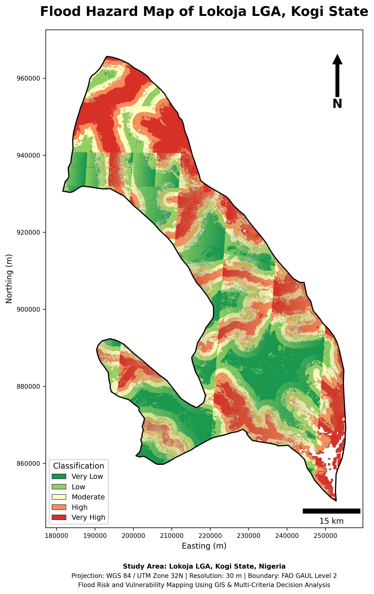
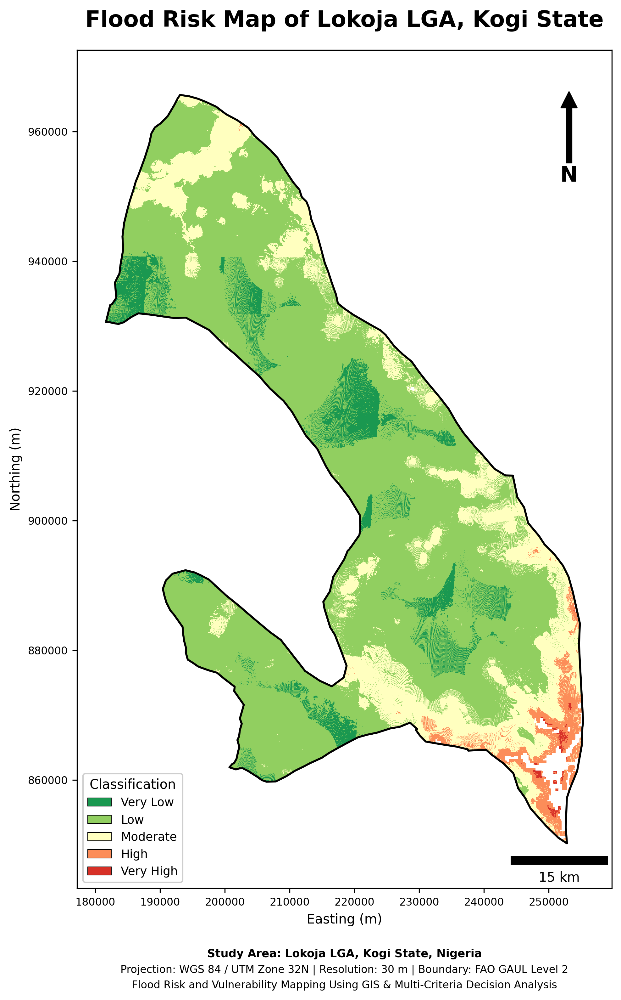
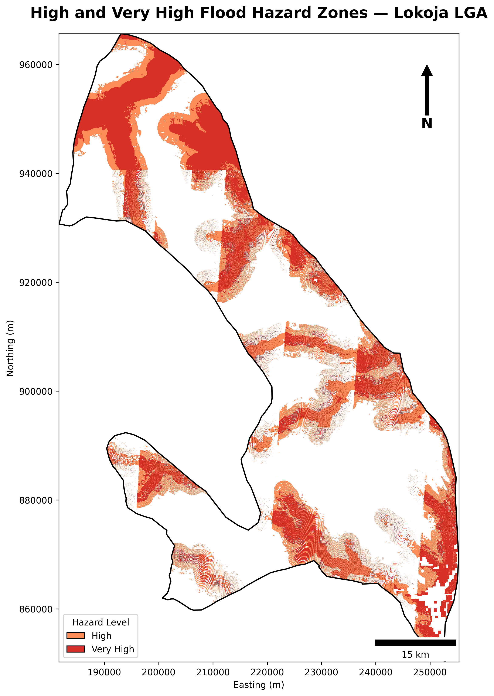
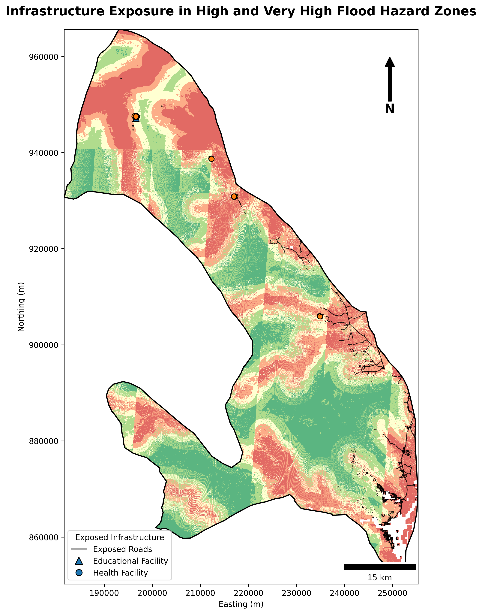
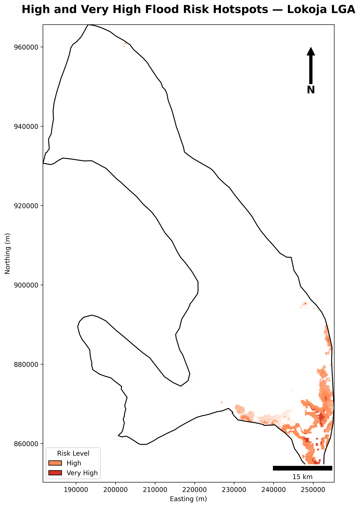
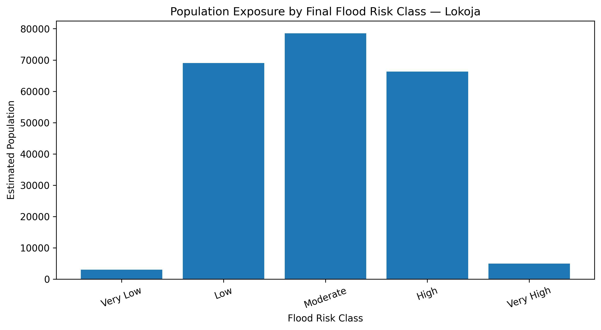

# GIS-Based Flood Risk and Vulnerability Assessment — Lokoja, Nigeria

**An MCDA/AHP-based assessment of flood hazard, population vulnerability, infrastructure exposure and final risk across Lokoja Local Government Area.**

<p align="center">
  
</p>

Lokoja lies at the confluence of the Niger and Benue river systems and faces recurrent flood exposure. This project integrated terrain, drainage, rainfall, land cover, vegetation, soil, population and built-environment indicators to map flood hazard and vulnerability at 30-metre resolution. The final risk surface combined physical hazard with population vulnerability through a Multi-Criteria Decision Analysis framework supported by the Analytic Hierarchy Process.

Approximately **1,305.10 km²**, representing **38.97%** of the classified area, fell within High or Very High flood-hazard classes. The final risk model identified **110.39 km²** as High or Very High risk. Although this area represented only **3.30%** of the classified risk surface, it contained an estimated **71,195 people**, equivalent to **28.05%** of the total 2020 population estimate.

Infrastructure exposure was substantial. Approximately **779.89 km of roads**, **7 educational facilities** and **21 health facilities** were located within High or Very High hazard zones. The AHP consistency ratio was **0.0093**, well below the conventional 0.10 threshold, indicating internally consistent pairwise weighting.

| Project detail | Information |
|---|---|
| **Study area** | Lokoja LGA, Kogi State, Nigeria |
| **Study-area size** | 3,406.82 km² |
| **Spatial resolution** | 30 m |
| **Primary method** | MCDA supported by AHP |
| **Estimated 2020 population** | 253,854 |
| **High + Very High hazard area** | 1,305.10 km² |
| **High + Very High final risk area** | 110.39 km² |
| **Population in High + Very High risk zones** | 71,195 |
| **AHP consistency ratio** | 0.0093 |

## Key findings

- **38.97%** of the classified area was High or Very High flood hazard.
- High hazard covered **621.89 km²**, while Very High hazard covered **683.22 km²**.
- High and Very High final risk covered **103.74 km²** and **6.65 km²** respectively.
- **71,195 people** were located in High or Very High final-risk zones.
- The final risk map represented approximately **87.37%** of the total estimated population.
- **779.89 km of roads** intersected High or Very High hazard zones.
- **7 educational facilities** and **21 health facilities** were exposed to High or Very High hazard.
- The AHP consistency ratio of **0.0093** confirmed acceptable weighting consistency.

## Analytical workflow

1. Prepared the official Lokoja boundary and projected all data to a common 30-metre grid.
2. Derived terrain, slope, drainage and hydrological indicators.
3. Processed rainfall, vegetation, land-cover and soil variables.
4. Prepared population and building-density vulnerability layers.
5. Standardised all criteria to comparable scales.
6. Applied AHP-derived weights to generate the flood-hazard index.
7. Classified hazard into five levels from Very Low to Very High.
8. Combined hazard and vulnerability to derive final flood risk.
9. Quantified population and infrastructure exposure.
10. Produced hotspot maps and planning-oriented result tables.

## Selected outputs

### Final flood-hazard map



### Final flood-risk map



### High and Very High hazard zones



### Infrastructure exposure



### High and Very High risk hotspots



### Population distribution by final-risk class



## Planning interpretation

The results indicate that flood hazard is spatially extensive, but the most severe final-risk zones are more concentrated because risk depends on both physical exposure and population vulnerability. These concentrated areas should receive priority for drainage improvement, floodplain management, emergency preparedness, infrastructure protection and risk-sensitive development control.

The outputs are screening and decision-support products. They do not replace hydraulic flood-depth modelling, engineering design, building-level surveys or site-specific environmental assessment. Population estimates and OpenStreetMap infrastructure records also carry uncertainty and should be updated before operational implementation.

## Repository structure

```text
.
├── assets/                  # Cover and social preview
├── data/processed/
│   ├── gis/                 # Boundary and social-infrastructure layers
│   ├── rasters/             # Final categorical hazard, risk and vulnerability rasters
│   └── tables/              # Hazard, risk, population and exposure statistics
├── docs/                    # Technical report and methodology notes
├── notebooks/               # Results-review notebook
├── outputs/
│   ├── maps/                # Five final planning maps
│   └── charts/              # Five result charts
├── scripts/python/          # Result-reproduction script
├── validation/              # Automated validation and inventory
├── CITATION.cff
├── LICENSE
├── README.md
├── project.json
└── requirements.txt
```

## Reproducibility

The repository publishes the final evidence products and scripts that verify the headline statistics. Large intermediate criteria rasters and the complete production environment remain in the master project archive.

```bash
pip install -r requirements.txt
python scripts/python/reproduce_summary.py
python validation/validate_repository.py
```

## Author

**Abdullah Abdazeez Ayomide**  
Geo-spatial Planner | GIS & Remote Sensing Analyst

- [GitHub](https://github.com/Abdullahabdazeez)
- [LinkedIn](https://ng.linkedin.com/in/abdazeez-abdullah-4b814719a)
- [Email](mailto:abdazeezabdullah1@gmail.com)

## Citation and licence

Citation metadata is provided in [`CITATION.cff`](CITATION.cff). Code and original documentation are released under the MIT License. External datasets retain their original licences and terms.
