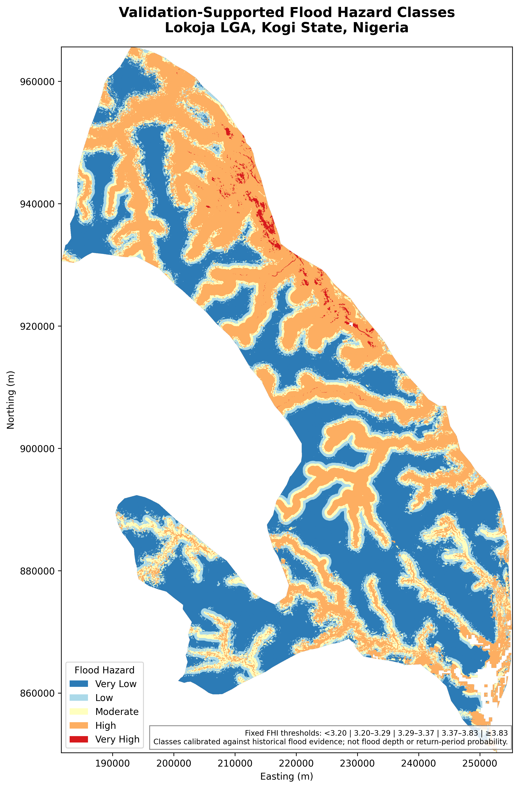
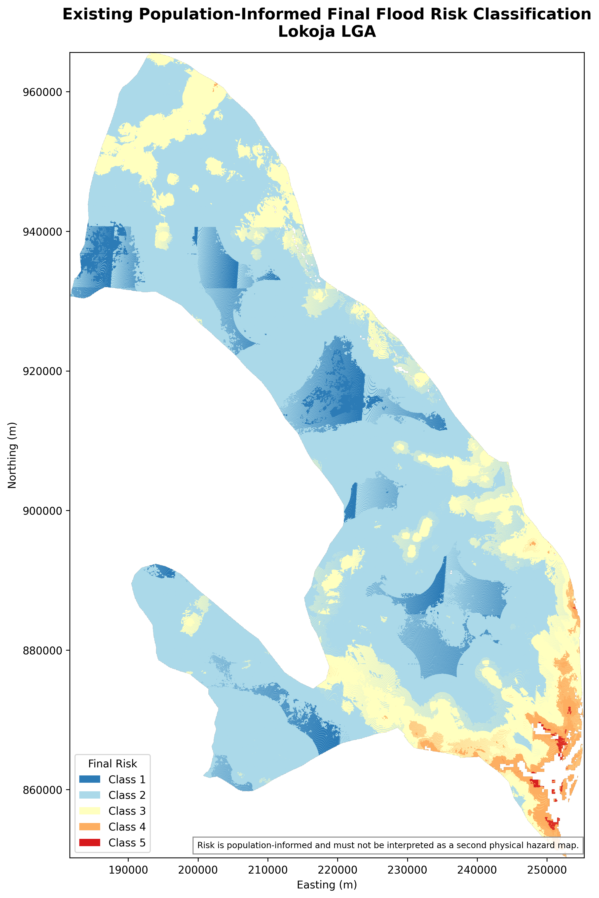

# Flood Hazard, Vulnerability and Risk in Lokoja, Nigeria

  

## What this project asks

Can a GIS-based flood-susceptibility model identify land that has historically flooded in Lokoja, and does the result remain stable when the model assumptions are changed?

Lokoja sits at the Niger–Benue confluence and has experienced major floods. I used a multi-criteria approach to map physical flood susceptibility, then kept that result separate from a population-informed risk layer.

A key part of this project was correcting an earlier classification problem. The previous five hazard classes behaved almost like equal-area quantiles, so I replaced them with **fixed Flood Hazard Index (FHI) thresholds calibrated against historical flood evidence**.

## Main findings

- **High + Very High hazard:** **1,136.71 km²**
- **Very High hazard:** **22.22 km²**
- Historical flood evidence captured by High + Very High hazard:
  - **2012: 85.08%**
  - **2018: 86.64%**
  - **2022: 86.36%**
- Mean class agreement across AHP weight perturbations: **91.21%**
- Minimum sampled FHI rank correlation across those perturbations: **0.99666**
- DEM ±10 m stress tests retain about **85.4–85.5%** class agreement

These checks suggest that the broad hazard pattern is not being driven by one fragile weight choice.

## How the flood-hazard model works

I combined eight flood-conditioning criteria using an Analytic Hierarchy Process (AHP) weighted linear combination.

| Criterion | Weight |
|---|---:|
| Distance to drainage | **24.58%** |
| Elevation | **20.29%** |
| Rainfall | **15.85%** |
| Slope | **12.18%** |
| Drainage density | **9.79%** |
| LULC | **7.37%** |
| Clay | **6.23%** |
| NDVI | **3.71%** |

The AHP consistency ratio is **0.0093**.

Before setting the final hazard classes, I compared the continuous FHI with satellite-derived flood evidence from **2012, 2018 and 2022**.

## Final hazard thresholds

| Hazard class | FHI rule |
|---|---|
| Very Low | FHI < 3.20 |
| Low | 3.20 ≤ FHI < 3.29 |
| Moderate | 3.29 ≤ FHI < 3.37 |
| High | 3.37 ≤ FHI < 3.83 |
| Very High | FHI ≥ 3.83 |

These are fixed numerical thresholds, not equal-area or quantile classes.

## Hazard is not the same as risk

  

The project separates **physical susceptibility** from **population-informed risk**.

Within the common analysis domain, High + Very High physical hazard covers **1,125.64 km²**. Only **58.54 km²** of that land remains High or Very High in the final risk classification.

Around **58.05%** of High/Very High hazard land becomes Low final risk, while **31.96%** becomes Moderate risk.

The final risk index is more strongly associated with population vulnerability (**Spearman ρ = 0.62144**) than with the FHI (**ρ = 0.35780**).

That does not mean the hazard model failed. It means that once human exposure and vulnerability are introduced, the final risk map answers a different question.

## Robustness checks

I tested 32 one-at-a-time AHP weight changes at ±10% and ±20%, renormalising every weight set back to one. I also tested uniform DEM offsets of −10 m, −5 m, +5 m and +10 m.

The DEM offsets are sensitivity scenarios, not measured Lokoja-specific DEM errors. Their purpose is simply to see whether a reasonable change in elevation values causes the hazard pattern to collapse.

## What this means for planning

The hazard map can support early screening for development control, drainage investment, emergency preparedness and locations that deserve more detailed hydraulic investigation.

The risk layer is useful for a different purpose: identifying where physical hazard overlaps with stronger human exposure or vulnerability.

Neither map should be treated as a substitute for hydraulic modelling or site-level engineering analysis.

## Important limitation

This is a **GIS/MCDA flood-susceptibility assessment**. It does not estimate flood depth, annual exceedance probability, return period or hydraulic flow behaviour.

That distinction is important because a susceptibility map can show where flooding is more plausible without telling us the exact depth or probability of a future event.

## Repository contents

The repository includes final maps and charts in [`assets`](assets/), authoritative result tables in [`data`](data/), methods and limitations in [`docs`](docs/), the final report in [`reports`](reports/), and validation evidence in [`validation`](validation/).

## Tools

Google Earth Engine · Python · Rasterio · GIS · Remote sensing · AHP/MCDA · Historical flood validation

## Author

**Abdullah Abdazeez Ayomide**  
Geospatial Planner · GIS & Remote Sensing Analyst · Urban & Environmental Planning Researcher

[GitHub](https://github.com/Abdullahabdazeez) · [LinkedIn](https://ng.linkedin.com/in/abdazeez-abdullah-4b814719a)

## Citation

Citation metadata is provided in [`CITATION.cff`](CITATION.cff).
